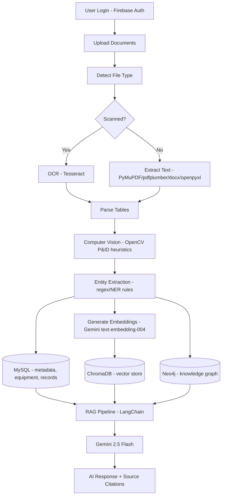
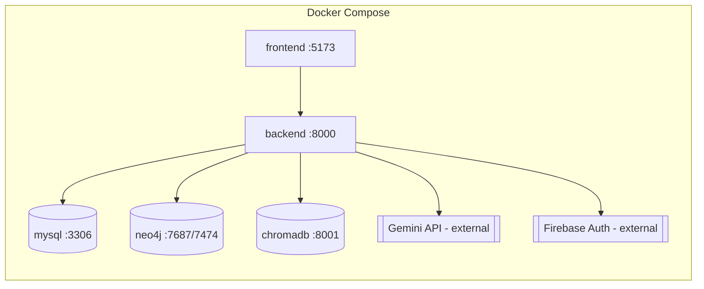

# FactoryBrain AI — Architecture

## System Flow

## Component Overview

| Layer | Technology | Responsibility |
|---|---|---|
| Frontend | React 19 + TypeScript + Vite + Tailwind | UI, auth flows, dashboards, chat |
| Auth | Firebase Authentication | Google + Email login, ID token issuance |
| API | FastAPI | REST endpoints, orchestration |
| Relational DB | MySQL | Users, documents, equipment, records, chat history |
| Vector DB | ChromaDB | Semantic search over document chunks |
| Graph DB | Neo4j | Equipment/Engineer/Document relationship graph |
| LLM | Gemini 2.5 Flash | RAG answer generation, root-cause analysis |
| OCR | Tesseract | Scanned document text extraction |
| CV | OpenCV | P&ID heuristic shape/tag detection |
| Orchestration | Docker Compose | Local/prod multi-service deployment |

## Request Flow: AI Chat

1. Frontend sends `POST /api/chat` with a Firebase ID token (Bearer auth) and the user's question.
2. Backend verifies the token via `firebase-admin`, resolves/creates the MySQL `User` row.
3. `app/services/rag.py` embeds the question (Gemini embeddings) and queries ChromaDB for the top-K most similar chunks.
4. Retrieved chunks + filenames are assembled into a grounded prompt and sent to Gemini 2.5 Flash via LangChain.
5. The response, confidence score (derived from retrieval similarity), and source citations are stored in `chat_history` and returned to the frontend.

## Deployment Topology

