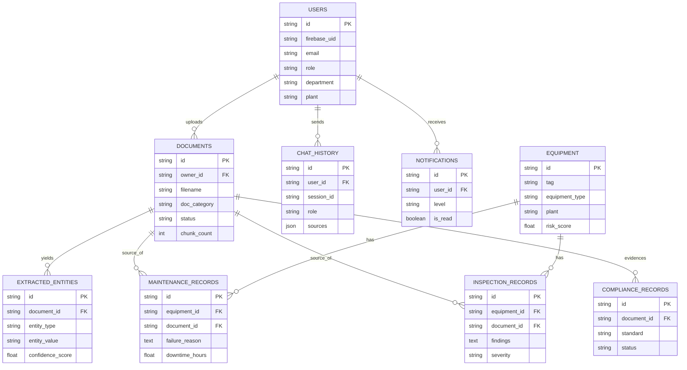

# Database Schema — MySQL

Full DDL lives in `database/schema.sql` and is mirrored by the SQLAlchemy
models in `backend/app/models.py` (the backend calls `create_all()` on
startup, so the two never drift as long as both are updated together).

## Entity-Relationship Overview

## Table Notes

- **users** — synced from Firebase on every successful login (`firebase_uid` is the join key).
- **documents** — one row per uploaded file; `status` tracks pipeline progress (`uploaded -> processing -> parsed -> embedded`, or `failed`).
- **extracted_entities** — generic entity table (equipment IDs, engineers, pressures, temperatures, dates, failure reasons, safety rules, regulatory references, locations), each with a `confidence_score`.
- **equipment** — deduplicated by `tag`; `risk_score` is recomputed by the maintenance intelligence engine.
- **maintenance_records / inspection_records** — structured records linked back to both the source `document` and the `equipment` they describe.
- **chat_history** — every AI Chat turn, including retrieved `sources` (JSON) and the confidence score shown in the UI.
- **compliance_records** — recomputed on each `GET /api/compliance` call by the compliance rule engine.
