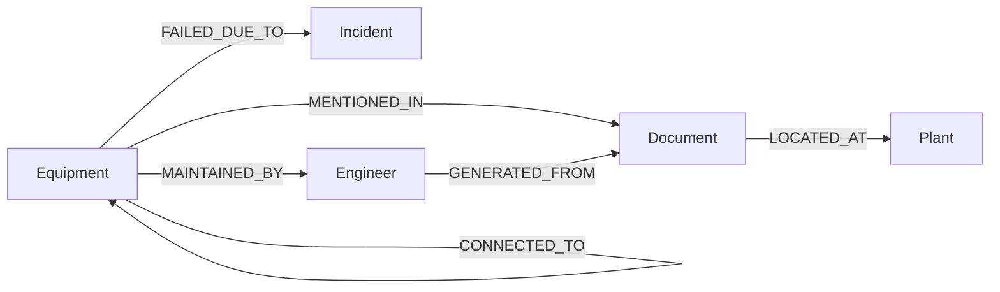

# Knowledge Graph — Neo4j

Built and queried by `backend/app/services/neo4j_service.py`.

## Node Types

| Node | Key property | Populated from |
|---|---|---|
| `Equipment` | `tag` (unique) | `EQUIPMENT_ID` entities extracted from any document, or CV-detected P&ID tags |
| `Engineer` | `name` | `ENGINEER` entities (e.g. "Prepared by: J. Rao") |
| `Document` | `id` | Every processed document |
| `Plant` | `name` | `PLANT` entities / user's assigned plant |
| `Incident` | `reason` + `document_id` | `FAILURE_REASON` entities |
| `Inspection` | (extendable) | Inspection records |
| `Regulation` | (extendable) | `REGULATORY_REFERENCE` entities |

## Relationships



- `MENTIONED_IN` — an Equipment tag appeared in a Document.
- `FAILED_DUE_TO` — links Equipment to an Incident node built from a `FAILURE_REASON` entity found near its tag.
- `MAINTAINED_BY` — links Equipment to the Engineer named in the same document.
- `GENERATED_FROM` — links an Engineer to the Document they authored/signed.
- `LOCATED_AT` — links a Document (and transitively its Equipment) to a Plant.
- `CONNECTED_TO` — reserved for P&ID-derived physical pipe connections between two Equipment nodes (populated when the OpenCV P&ID pipeline resolves a pipe endpoint to two tagged symbols).

## Querying

`GET /api/graph` runs:

```cypher
MATCH (n)-[r]->(m)
RETURN n, r, m
LIMIT $limit
```

and the frontend's Knowledge Graph page lays the returned nodes/edges out
with a lightweight force-directed simulation computed client-side (see
`frontend/src/pages/KnowledgeGraph.tsx`).

## Extending the Graph

To add a new relationship type (e.g. `CONNECTED_TO` from P&ID pipe
detection), extend `upsert_equipment_from_entities` (or add a new function)
in `neo4j_service.py`, and call it from `app/services/pipeline.py` once the
CV analysis (`cv_pid.analyze_pid_page`) resolves which two equipment tags a
detected pipe segment connects.
